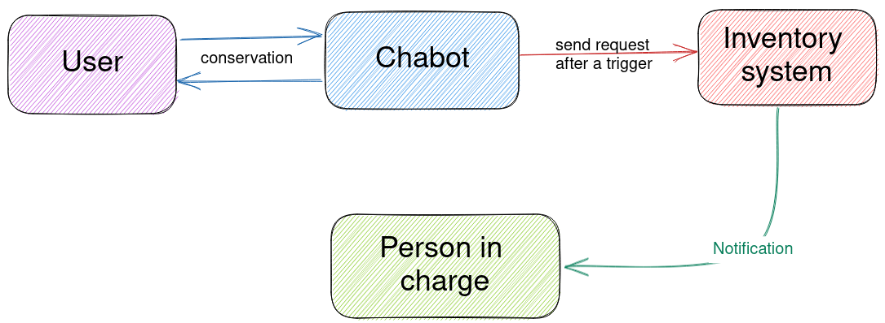
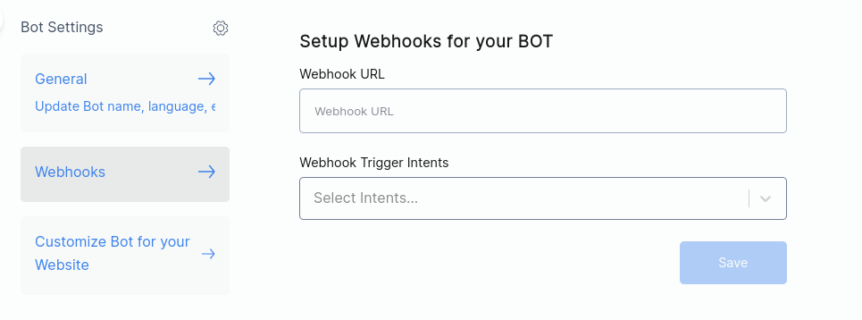
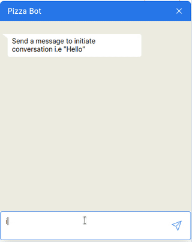
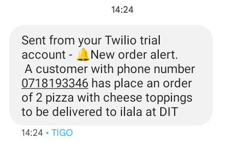

# Know about webhook

As our chatbot(talking about our `[PizzaBot](https://docs.sarufi.io)`) has ability to handle conversational as we needed to be. We can add extra ability to let it interact with other systems, such as databases, APIs, and third-party applications.

This is possible by utilizing sarufi's webhook functionality to automate workflows. This will make our previous chatbot so powerful and useful. We can integrate webhook into our chatbot to handle things like payments,update inventories, update delivery tracking system.

## Webhook

Lets have a simple explanation on webhook.

A webhook is a  HTTP-based callback mechanism that allows two systems to communicate in real-time. It is triggered when an event occurs, such as a order confirmation. When the event is triggered, the webhook sends a request to a specified URL, which can be used to trigger an action, such as updating a database or sending a payment push, updating delivery system, sending message notification.

**NOTE** Remember that webhook is only one way communication.

All you have to do is specify which states should trigger the webhook and set webhook url in sarufi.

## Preparing the runway 🛣

With our pizza bot, we shall set up the webhook to send a person in charge a notification of new confirmed order.



Steps:

- Have a public url

- Set trigger intents

    Navigate to your sarufi account --> `settings` --> `Webhook`. Select the intent(s) that will trigger sending of data to your webhook url. Then `save`



- Process reeived data

- Send request to other system

## Our Take-off 🛫

I will be using flask to set up my server and twilio to send message notification to alert me when new order is confirmed.

You can use replit or ngrok to make your server available online. All based on our pizza bot we have been working on

### Take of with replit

Way to go

1. Fork the [repo](https://replit.com/@jovyinny/sarufi-bot-webhook)

2. Create secret keys

    |Secret key| Description|
    |---|---|
    |phone_number|"Your twilio phone number"|
    |twilio_SID|"Your Twilio SID"|
    |twilio_assigned_phone_number|"Youe twilio assigned number"|
    |twilio_auth_token|"Twilio auth token"|

3. Webhook url

    To obtain a public url for your flask server, run your script. Then a small web preview window will open up with url in format like `https://{your repl name}.{your replit usermae}.repl.co`

4. Set up sarufi webhook

    Navigate to your sarufi account --> `settings` --> `Webhook`. Select the intent(s) that will trigger sending of data to your webhook url. Then `save`

    **Note:** The route that receives new order is `/new-order`. So your url will be like `https://{your repl name}.{your replit usermae}.repl.co/new-order`


### Take of with Ngrok

STEPS:

1. Clone  the repository, simply run

    ```bash
    git clone https://github.com/jovyinny/sample-webhook.git
    ```

2. Create `.env` file

    We are going to create `.env` file to hold our secret keys from Twilio

    ```text
    phone_number="Your twilio phone number"
    twilio_SID="Your Twilio SID"
    twilio_assigned_phone_number="Youe twilio assigned number"
    twilio_auth_token="Twilio auth token"
    ```

3. Run the script

    ```bash
    python3 main.py
    ```

4. Start ngrok server

    ```bash
    ./ngrok http 5000
    ```

5. Finish up

    After running the command, you will have to copy the url ngrok provides. The url looks like `https://xxxxxxxxxxx.ngrok.io`

6. Set sarufi webhook

    With url from ngrok, its time to set up our new pizza order alert.Navigate to your sarufi account --> `settings` --> `Webhook`. Select the intent(s) that will trigger sending of data to your webhook url. Then `save`.

    **Note:** The route that receives new order is `/new-order`. So your url will be like `https://xxxxxxxxxxx.ngrok.io/new-order`

## Landing 🛬

With everything set, lets make order to our chatbot.



Notification message


